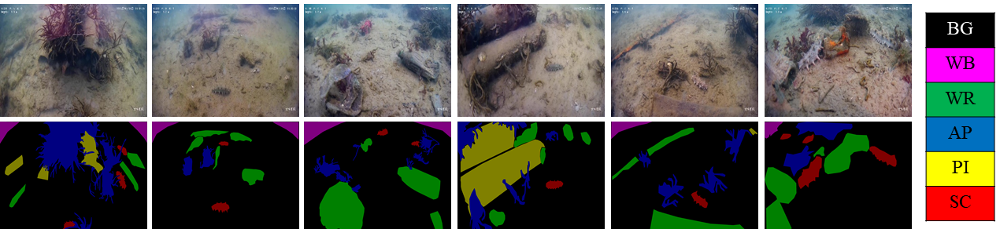

# Sea Cucumber Habitat Parsing Dataset (SC-HPD)
    
  
  ### SC-HPD Dataset
- For semantic segmentation of sea cucumber habitat.
- 600 1080p images and ground-truth masks for 6 classes.
- **BG**:Background       •**WB**:Waterbody   •**WR**:Wrecks/ruins
- **AP**:Aquatic plants   •**PI**:Pipelines   •**SC**:Sea cucumber
## Contributors
    Kunqian Li, Weilin Du, Yunlong Zhuang, Bingye Wang, Zhihao Huang and Sheng Gao from Ocean University of China.

## Downloads
The data is available for download on [Google Drive](https://drive.google.com/file/d/1SCom7vjxjDyYiOaZScuPX8rP6DEJXmCe/view?usp=sharing).  

On extraction, the downloaded file results in the following directory

        SC-HPD/
            Annotations/
                600 annotation files.
            JPEGImages/
                600 RGB images.
            SegmentationClass/
                600 ground-truth segmentation labels.

## Bibtex
If you find this dataset helpful, please cite the following works.

    @misc{qi2022sguienet,
     title={SGUIE-Net: Semantic Attention Guided Underwater Image Enhancement with Multi-Scale Perception},
     author={Qi Qi and Kunqian Li and Haiyong Zheng and Xiang Gao and Guojia Hou and Kun Sun},
     year={2022},
     eprint={2201.02832},
     archivePrefix={arXiv},
     primaryClass={eess.IV}
    }
